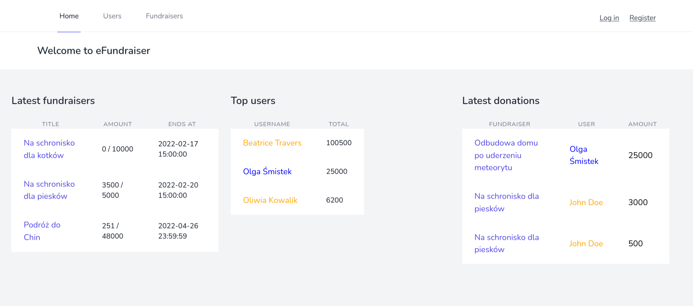
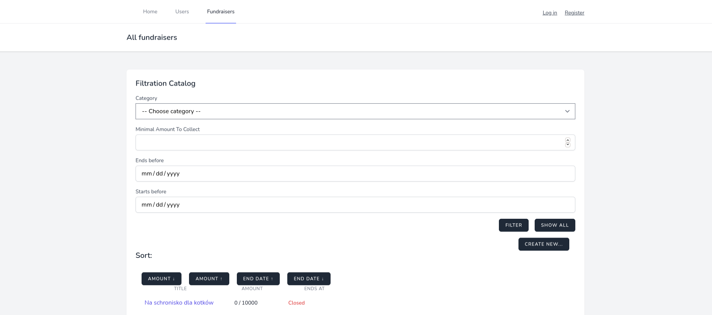
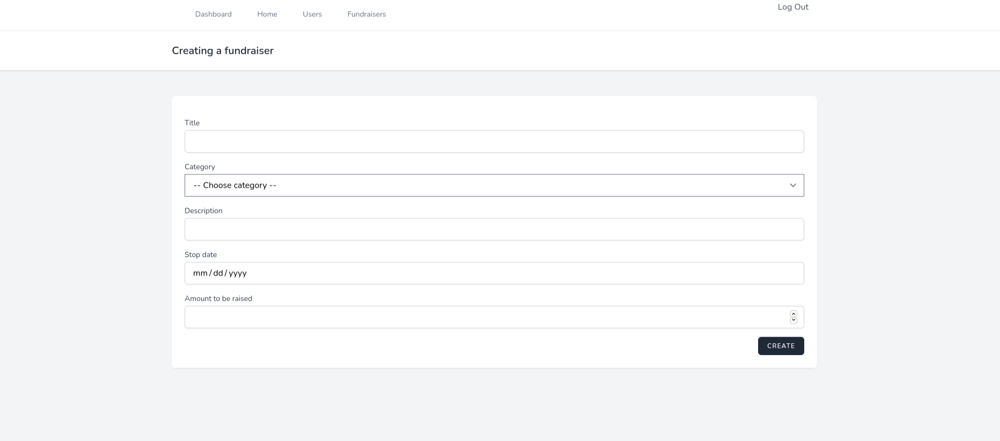
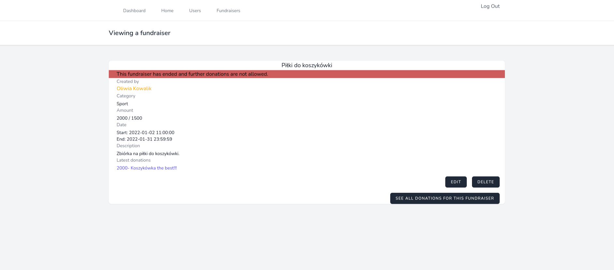
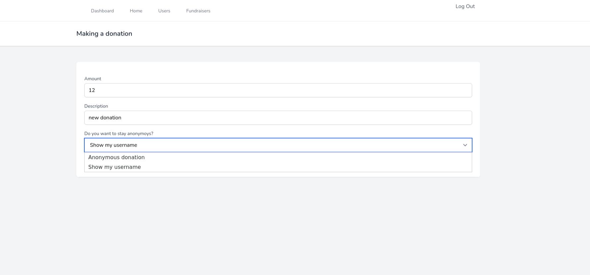
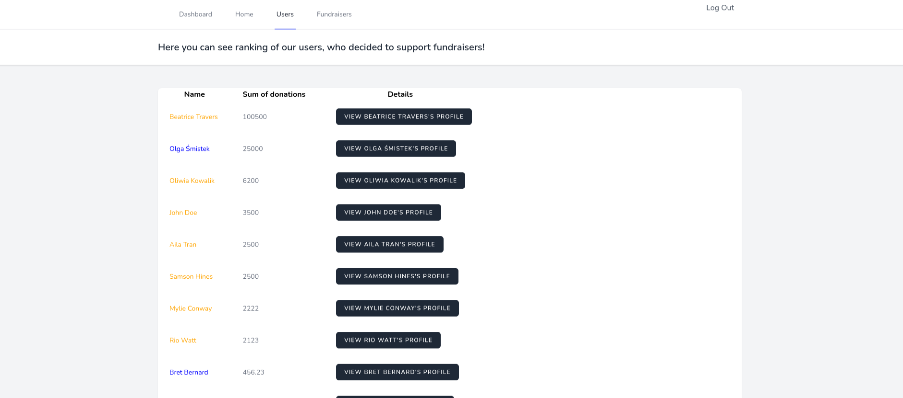

# eFundraiser
Group project of web application for creating and donating fundraisers. Main view is a list of latest fundraisers, donations and top users.

By choosing one of the options on navigation bar you can easily switch to list of all fundraisers which you can filer and sort through all of features.

Guest can only scroll through website, users can make a donations and verified ones can even create them own fundraisers.

Every fundraiser has details such as owner, title, description, amount to be raised, amount raised and latest donations. 

User can make a donation by using simple form, every donation can be public or annonymous.

There is also a ranking users. Most active ones are specially marked (name is orange instead of blue).

